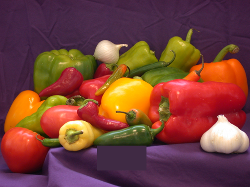

# Variational model of perceived contrast for inpainting
MATLAB re-implementation 
```
Selection of achromatic and non-neutral colors to fill lacunae 
in frescoes guided by a variational model of perceived contrast"
Luca Grementieri, Edoardo Provenzi
Proceedings Volume 10225, Eighth International Conference on Graphic 
and Image Processing (ICGIP 2016); 102251Z (2017) 
https://doi.org/10.1117/12.2267773
8th Int. Conf. on Graphic and Image Processing, 2016, Tokyo, Japan
```

Author: Simone Parisotto, 16/10/2019

**Version 1.0**
 
 
 

**Date:16/10/2019**

### License
[BSD 3-Clause License](https://opensource.org/licenses/BSD-3-Clause)
